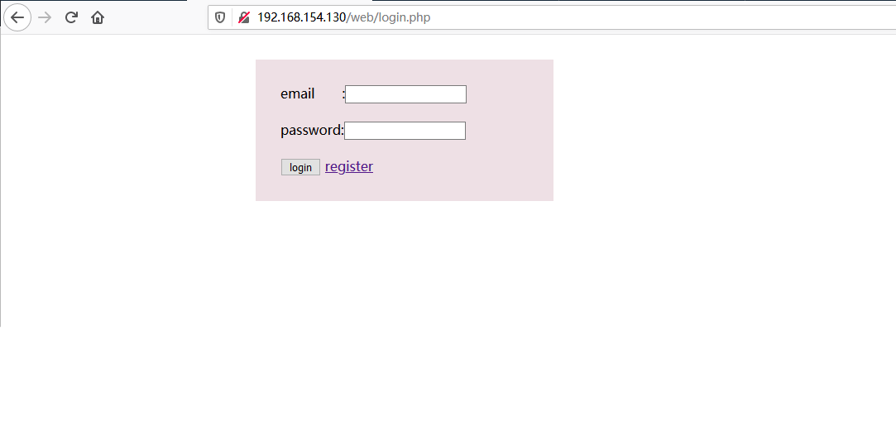

### 说明
本项目是根据网鼎杯张三的网站题目模仿做出来的，因为没有原题源码，只能自己手撸一个，加上PHP又很菜，一边Google一边var_dump写出来的，代码质量之差请见谅，只是给想做相关实验的朋友提供一个环境。

### 部署方法
推荐使用XAMPP集成环境进行本地部署实验。
1. 部署MySQL数据库
   创建test数据库，然后把sql.txt内容导入到数据库即可，网上都有教程，不赘述了。
2. 配置MySQL远程连接，使用XAMPP提供的phpmyadmin配置即可，其它情况可自行搜索。

3. 最终的表结构如下：

### 测试
部署成功后访问conn.php，如果没报错则表示连接数据库成功

登录页面：

注册页面：

个人主页：
